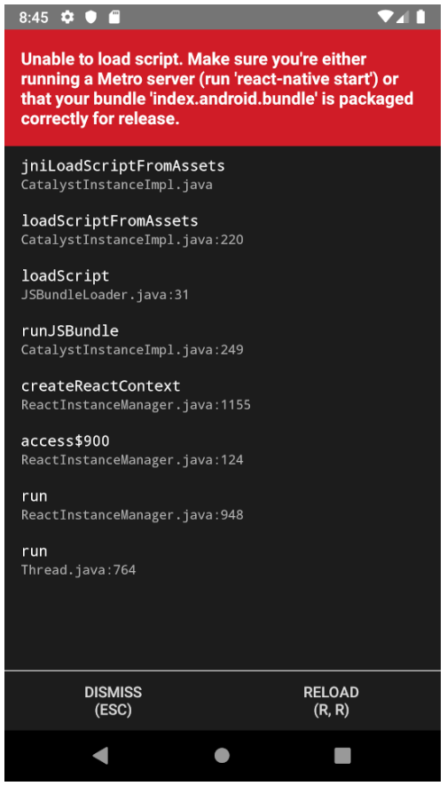

# android-stduio 기기 usb 에러

해당 에러는 virtualBox에서 설정탭 -> usb포트 연결을 하면 된다.

# react-native run-android (java virtual machine error)

해당 에러는 java를 설치하고 환경변수를 지정해주면 된다.  
```sudo apt-get install openjdk-8-jre```  
```sudo apt-get install openjdk-8-jdk```  

- 환경변수 지정  
```sudo nano /etc/profile```  
```export JAVA_HOME=/usr/lib/jvm/java-8-openjdk-amd64```  
```export PATH=$JAVA_HOME/bin:$PATH```  
```export CLASS_PATH=$JAVA_HOME/lib:$CLASS_PATH``` 

- 환경변수 지정 (위에 것 안될 시)
근본적으로 이게 안되는 이유는 java의 환경변수가 지정이 안돼서 java virtual machine이 활성화가 안돼는듯..
1. javac의 위치를 확인한다
``` readlink -f /usr/bin/javac ``` 
--> javac의 실제위치는 /usr/lib/jvm/java-8-openjdk-amd64/ 로 지정한다.

2. vi ~/.bashrc
```
export JAVA_HOME=/usr/lib/jvm/java-8-openjdk-amd64
export PATH="$PATH:$JAVA_HOME/bin”
```
3. source ~/.bashrc
4. echo $JAVA_HOME 
  
  
```[패키지명]/android/app/src/main/assets 폴더가 있는지 확인하고 없으면 생성```  
```[패키지명]/android --> ./gradlew clean 실행```  
```[패키지명] => react-native bundle --platform android --dev false --entry-file index.js --bundle-output android/app/src/main/assets/index.android.bundle --assets-dest android/app/src/main/res 실행```  

# android bundle 설정문제
- 기기에서 <em>change Bundle Location</em> 누르고 <em>localhost:8081</em>  
  
``` adb reverse tcp:8081 tcp:8081 ```  
``` react-native run-android ```  
이러면 될거임
